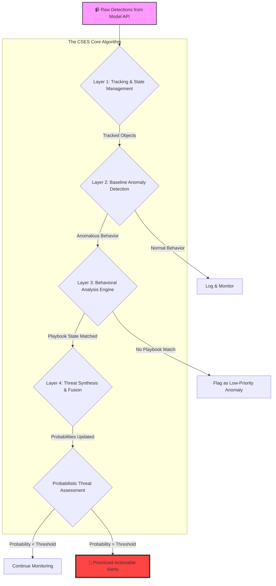

# 🛡️ CSES - City Security Evaluation System (Algorithm for Threat Detection)


**CSES** is a Python implementation of an advanced, multi-layered algorithm for real-time threat detection from object detection data. It is designed to be robust, context-aware, and adaptable, moving beyond simple rule-based systems to a more sophisticated approach suitable for security, police, and military applications.

The core principle of this algorithm is to understand **intent** and **normalcy**. It does this not by just flagging single actions, but by identifying deviations from normal behavior and matching sequences of actions to known hostile tactics.

## ✨ Key Features

-   🧠 **Multi-Layered Architecture:** A robust and explainable decision-making process composed of distinct layers for anomaly detection, behavioral analysis, and threat synthesis.
-   📈 **Pattern-of-Life (PoL) Anomaly Detection:** Instead of relying on manually-drawn "no-go" zones, the system learns a baseline of normal activity. Threats are flagged as significant deviations from this baseline, making the system highly adaptable to new environments.
-   📚 **Threat Playbook Modeling:** Hostile tactics (e.g., VBIED drop-off, perimeter probing) are modeled as state machines called "Playbooks." The algorithm matches an object's sequence of behaviors to these predefined attack patterns.
-   📊 **Probabilistic Scoring:** Uses a simplified Bayesian inference model to update the probability of a threat. Each piece of evidence multiplies the belief in a potential threat, providing a more nuanced and accurate assessment than simple point-addition systems.
-   🔌 **API-Ready Design:** The main processing loop is designed to ingest frame-by-frame data, making it straightforward to integrate with a live video feed processed by a computer vision model API.
-   📢 **Explanatory Power:** Final alerts provide actionable intelligence, specifying the *type* of threat suspected (e.g., `VBIED_DROPOFF`) and the confidence level, giving human operators the context they need to act decisively.

## 🏗️ Architectural Overview

The CSES algorithm processes data through a sophisticated pipeline designed to build a comprehensive understanding of the scene, moving from raw data to actionable intelligence.



##  Walkthrough: VBIED Drop-off

Here's how the layers work together to detect a complex threat, visualized as a state machine.

```mermaid
stateDiagram-v2
    [*] --> Tracking
    Tracking --> Anomalous_Stop : Vehicle stops in a non-standard location
    Anomalous_Stop --> Driver_Exit : Person is detected exiting the vehicle
    Driver_Exit --> Separation : Person moves away from the vehicle
    Separation --> THREAT_CONFIRMED : "Separation" condition met
    THREAT_CONFIRMED --> [*]

    state Anomalous_Stop {
        direction LR
        [*] --> state1
        state1 : Threat Probability * 10
    }
    state Driver_Exit {
        direction LR
        [*] --> state2
        state2 : Threat Probability * 50
    }
    state Separation {
        direction LR
        [*] --> state3
        state3 : Threat Probability * 100
    }
    state THREAT_CONFIRMED {
        note right of THREAT_CONFIRMED
            Final Probability > 95%
            Generate CRITICAL Alert!
        end note
    }
```

## 🚀 Getting Started

### Prerequisites

-   Python 3.8+
-   No external libraries are required to run the simulation.

### Installation

Clone the repository to your local machine:
```bash
git clone https://github.com/your-username/CSES.git
cd CSES
```

### Running the Simulation

The included `threat_detector.py` file contains the full algorithm and a built-in simulation of the VBIED drop-off scenario described above.

To run the simulation, execute the file from your terminal:
```bash
python threat_detector.py
```

### Expected Output

You will see a step-by-step log showing the system's reasoning process as the simulation unfolds:

```text
--- Military-Grade Threat Detection Simulation ---

--- Processing Frame at Time: 1.0s ---
  Van (ID 101) Status | Playbook State: N/A | VBIED Probability: 0.000100

--- Processing Frame at Time: 2.0s ---
  Van (ID 101) Status | Playbook State: N/A | VBIED Probability: 0.000100

--- Processing Frame at Time: 3.0s ---
DEBUG: Object 101 advanced to state 'STOPPED_IN_ANOMALOUS_ZONE' in playbook 'VBIED_DROPOFF'
  Van (ID 101) Status | Playbook State: STOPPED_IN_ANOMALOUS_ZONE | VBIED Probability: 0.003000

--- Processing Frame at Time: 5.0s ---
DEBUG: Object 101 advanced to state 'DRIVER_EXIT' in playbook 'VBIED_DROPOFF'
  Van (ID 101) Status | Playbook State: DRIVER_EXIT | VBIED Probability: 0.150000

--- Processing Frame at Time: 7.0s ---
DEBUG: Object 101 advanced to state 'SEPARATION' in playbook 'VBIED_DROPOFF'
  Van (ID 101) Status | Playbook State: SEPARATION | VBIED Probability: 0.999000

  !!! ACTIONABLE THREAT DETECTED !!!
  > ALERT: Object ID 101 is a possible VBIED_DROPOFF.
    CONFIDENCE: 99.9%
    ACTION: IMMEDIATE INVESTIGATION REQUIRED.
```

## 🛠️ Integration & Real-World Use

To adapt this code for a real-world application, consider the following steps:

1.  **Connect a Live Model:** Replace the `simulation_api_feed` with a loop that fetches JSON data from your model's API endpoint.
2.  **Implement an Object Tracker:** Ensure your computer vision pipeline includes a robust object tracker (e.g., DeepSORT, ByteTrack) that provides consistent `obj_id`s. This is crucial for behavioral analysis.
3.  **Train the Baseline Model:** The `BaselineModel` class is currently a simulation. For a real deployment, this layer must be trained on hours or days of footage from the target camera to learn the actual patterns of normal activity for that specific scene.
4.  **Calibrate Your Camera:** To get accurate speed and distance calculations, implement a transformation from pixel space to real-world coordinates (e.g., meters) using camera calibration techniques.
5.  **Expand Threat Playbooks:** The `BehavioralEngine` is designed for easy expansion. Add new threat definitions to the `_load_playbooks` method to allow the system to detect a wider range of hostile tactics.

## 🤝 Contributing

Contributions are welcome! Please feel free to fork the repository, make improvements, and submit a pull request. For major changes or new features, please open an issue first to discuss what you would like to change.

## 📜 License

This project is licensed under the GNU General Public License v3.0  - see the [LICENSE](LICENSE) file for details.
